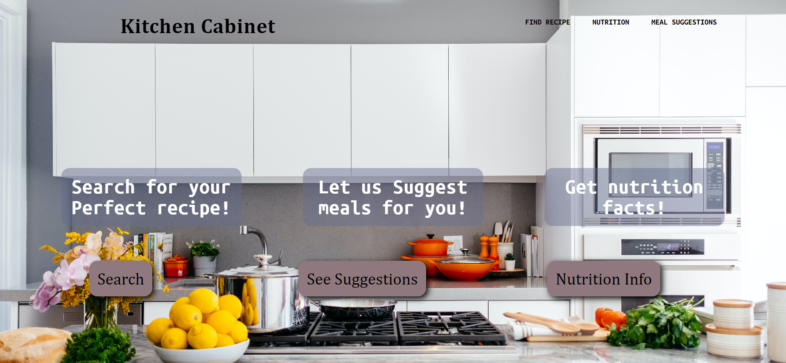
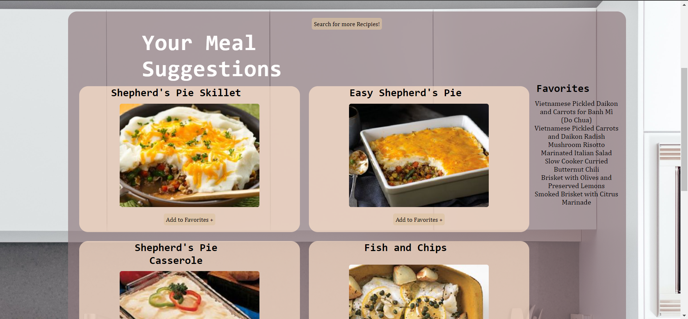

# Project1

##Concept

his site will be a place for the user to find whatever recipe they need. They will be able to search for a recipe. If, they do not know what they want to make they can use our suggestions page to find suggestions based on the parameters they use. The user will also be able to look at the nutritional information for any food ingredient that they want in their recipe. 
We wanted to make a single place where someone can go to find any recipe they need 
AS A cook, I WANT to look for a recipe, SO THAT I can make the perfect meal.

##Process

-Technologies used: HTML, CSS, JavaScript, Track API, Spoonacular API, and TheMealDB API.
-Breakdown of tasks and roles: We broke up the tasks between the HTML pages used. Each person made the HTML, CSS, and JavaScript files for their page.
-Challenges: Finding the right APIs, pulling the right information from the APIs, Using the API’s more fluidly.
-Successes: Found multiple API’s that can be used for a single Website.

## Contributors

* Emily Mora 

* Gary Dutra

* Mohamad Ghaznawy

* Nico Alcantara

##Directions for Future Development

-Styling can be consistently improved. 
-Have a more interactive Landing Page.
-API’s can be added for locations for ingredients at grocery stores.

Link to the GitHub Repo

https://github.com/Emilymora1207/Recipe-Hub.git
